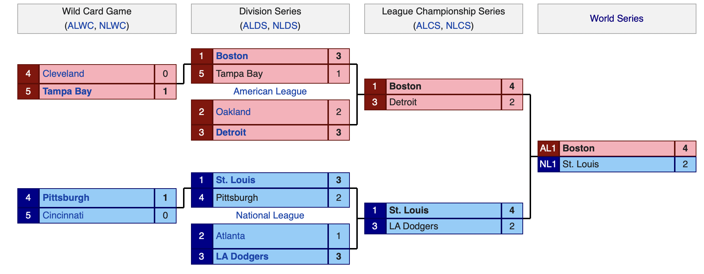

```{r,echo=FALSE, collapse=TRUE, message=FALSE}
library("rmarkdown")
library("dplyr")
library("Lahman")
library("ggplot2")
library("formattable")
library("knitr")
library("car")
library("stargazer")
library("MVN")
library("broom")
library("Hmisc")
library("lmtest")
library("stargazer")
```

```{r setup, include=FALSE}
knitr::opts_chunk$set(echo = TRUE)
```

```{r, echo=FALSE, out.width="75%", fig.align='left'}
knitr::include_graphics("2013_World_Series_logo.png")
```

<h1 style="text-align: left;">Introduction</h1>

In 2013, MLB baseball saw the Boston Red Sox win their third World Series in 10 seasons over the St. Louis Cardinals with David Ortiz taking home World Series MVP honors. No one was really shocked by these two teams making it to the World Series. They were head and shoulders better than the majority of their respective leagues and truly dominated their way to the World Series. These two teams we great on the field and but had a seemingly significant difference in funding, Boston at 150+ Million and St.Louis at 92 Million. Additionally, they were both considered to be two of the better teams when it came to pitching and hitting. With future Hall of Famers such as Manny Rameriez, David Ortiz, and Pedro Martinez for Boston, to name a few. However, St. Louis had a few names of their own to include Albert Pujlos, Jim Edmonds, and Mark Mulder. But we are not here to discuss who made it to the World Series, but to discover what 'ingredients' it takes to "March into October". 

The premise of this analysis is to understand if we can predict the number of expected wins a team recorded based on a teams runs scored, runs allowed, payroll, weighted on-base-average (wOBA), and fielding independent pitching (FIP). In theory, payroll enables teams to purchase the best players and the best players should be able to score the most runs while giving up the fewest. Those expected win totals will give us an understanding of the teams that should have made the playoffs in 2013. This would be based on the number of runs they scored versus the number of runs given up. Additionally, we look to observe if advanced metrics such as wOBA and FIP can explain any of the variation we observe with a team's win total in 2013. 

```{r, echo=FALSE, out.width="75%", fig.align='center'}

```

###### Note: For everyone's knowledge, in 2013, 10 teams made it to the Major League Postseason. The Boston Red Sox, Oakland Atheletics, Detroit Tigers, Cleveland Indian, and Tampa Bay Rays represented the American League. In the National League the St. Louis Cardinals, Atlanta Braves, Los Angeles Dodgers, Pittsburgh Pirates, and Cincinnati Reds made the playoffs. In Major League Baseball, three teams in each league gain a playoff spot by winning their division, the other two spots are filled with the next highest records of a given team. So, if a team had 82 wins and led their division they would be in the playoffs over a team that may have won 89 games and finished 4th in another division.

<h1 style="text-align: left;">Data Preparation</h1>

#### Reading & Loading Packages
- rmarkdown
- ggplot2
- dplyr
- Lahman
- formattable
- knitr
- car
- MVN
- broom
- lmtest
- stargazer

#### Data Table Variable Definitions
##### Batting
- playerID: A players unique I.D.
- yearID: Year of Record
- teamID: Team of Record
- AB: Plate appearances by a batter (minus walks or HBP)
- R: Total number of Runs recorded by a batter
- H: Total number of singles recorded by a batter
- X2B: Total number of doubles recorded by a batter
- X3B: Total number of triple recorded by a batter
- HR: Total number of Home Runs recorded by a batter
- BB: Total number of UNINTENTIONAL Walks recorded by a batter
- IBB: Total number of INTENTIONAL Walks recorded by a batter
- HBP: Total number of occurances a batter was HIT BY A PITCH
- SF: Total number of Sacrifice Flies by a batter
- wOBA: A batter's Weighted On-Base-Average
- TEAMwOBA: A given team's average Weighted On-Base-Average in 2013

##### Pitching
- playerID: A players unique I.D.
- yearID: Year of Record
- teamID: Team of Record
- HR: Home Runs allowed by a pitcher in a given year
- BB: Number of walks a pitcer gave up in a given year
- HBP: Number of hitters a pitcher hit with a pitch in a given year
- SO: Number of strikeouts a pitcher recorded in a given years
- IPouts: Number of outs a pithcer recorded in a given year
- FIP: Fielding Independent Pitching Metric
- TEAMFIP: A given team's average Fielding Independent Pitching in 2013

##### Salaries
- yearID: Year of Record
- teamID: Team of Record
- lgID: League Identifier
- playerID: A players unique I.D.
- salary: Salary compensation of an individual player on a roster
- Payroll: Total amount of money paid to field a team for a given season in Millions $

##### Teams
- yearID: Year of Record
- teamID: Team of Record
- lgID: League Identifier
- W: Number of Wins a team recorded in a season
- L: Number of Loses a team recorded in a season
- R: Number of Runs scored FOR a team recorded in a season
- RA: Number of Runs scored AGAINST a team in a season
- EWP: Expected Win Percentage
- EWins: Expected WINS (Forecast)
- AWP: Actual Win Percents

<h1 style="text-align: left;">Creating Data Frames</h1>
```{r echo = FALSE, message=FALSE, collapse=TRUE}
#Loading in the salaries of each team for the 2013 Season
S <- Lahman::Salaries %>% select(yearID,teamID,lgID,playerID,salary) %>%
  filter(yearID==2013) %>%
  group_by(teamID) %>%
  mutate(Payroll = sum(salary)) %>%
  mutate(Payroll = Payroll/1000000)

#Loading in the general statistics of each team for the 2013 Season
T <- Lahman::Teams %>% select(yearID,lgID,teamID,W,L,R,RA) %>%
  filter(yearID==2013) %>%
  group_by(teamID)

#Loading in individual batting statistics for the 2013 Season
B <- Lahman::Batting %>% select(playerID,yearID,teamID,AB,R,H,X2B,X3B,HR,BB,IBB,HBP,SF)%>%
  filter(yearID==2013) %>%
  filter(AB >= 120) %>%
  mutate(wOBA = (((0.69*BB) + (0.719*HBP) + (0.87*H) + (1.217*X2B) + (1.529*X3B) + (1.94*HR)) / 
                (AB+BB+IBB+SF+HBP)))%>%
  select(playerID,yearID,teamID,wOBA)

#Loading in individual pitching statistics for the 2013 Season
P <- Lahman::Pitching %>% select(playerID,yearID,teamID,HR,BB,HBP,SO,IPouts) %>%
  filter(yearID==2013)%>%
  filter(IPouts >= 60) %>%
  mutate(IP = IPouts/3) %>%
  mutate(FIP = ((HR*13 + 3*(BB+HBP) - 2*SO) / 
                  IP + 3.2)) %>%
  select(playerID,yearID,teamID,FIP,IP)

#Merge Salaries, Teams, Batting, and Pitching, Dataframes by Teamid, Yearid, and Leagueid to create 
#One Dataframe for analysis
df <- left_join(S, T, by = c("teamID", "yearID", "lgID"))
df <- left_join(df,B, by = c("playerID", "teamID", "yearID"), na_matches="never")
df <- left_join(df,P,by = c("playerID", "teamID", "yearID"), na_matches="never")

df <- df %>%
  group_by(teamID) %>%
  mutate(TEAMFIP =mean(FIP, na.rm=TRUE))

df <- df %>%
  group_by(teamID) %>%
  mutate(TEAMwOBA =mean(wOBA, na.rm=TRUE))

#Removing duplicate observations for one observation per team
df2 <- subset(df, !duplicated(df$teamID))

#Selecting need columns for analysis
df2 <- df2 %>% select(teamID,lgID,Payroll,W,L,R,RA,TEAMwOBA,TEAMFIP)

# Creating Predictive Model of teams that did make the playoffs verses those who are
#predicted to make the playoffs
Data <- df2%>%
  mutate(EWP = ((R/RA)^1.6)/((R/RA)^1.6+1), EWins = round(EWP*162), AWP = W/162, WinPctDiff = AWP-EWP)

DataNeat <- Data

DataNeat$Payroll <- currency(DataNeat$Payroll, digits = 0L)

DataNeat$TEAMwOBA <- percent(DataNeat$TEAMwOBA, digits = 2L)

DataNeat$EWP <- percent(DataNeat$EWP, digits = 2L)

DataNeat$AWP <- percent(DataNeat$AWP, digits = 2L)

DataNeat$WinPctDiff <- percent(DataNeat$WinPctDiff, digits = 2L)
```

<h4 style="text-align: left;">Sean Lahman's Major League Baseball Statistic Descriptions</h4>

Lahman's "Salaries" data frame highlights and summarizes the payroll of each team in 2013 along with the individual amount players made in 2013. For this analysis, we were not interested in individual pay, only the sum of what each team spent in 2013. Therefore, we will remove players names, IDs, and individual salaries from the table. 

Lahman's "Teams" data frame highlights and summaries each team's wins, losses, runs scored, runs allowed, and playoff win statistics. These columns will be used to help us predict future win totals and see if our model is statistically significant and accurate at predicting playoff teams. 

Lahman's "Batting" data frame highlights and summarizes the the team batting statistics of each team in 2013. For this analysis, we were not interested in individual pitching performance, only the sum of how each team performed in 2013. 

Lahman's "Pitching" data frame highlights and summarizes the the team pitching statistics of each team in 2013. For this analysis, we were not interested in individual pitching performance, only the sum of how each team performed in 2013.

```{r echo = FALSE, results = 'asis'}
library(knitr)
kable(DataNeat, caption = 'Summary Statisitics')
```

<h1 style="text-align: left;">Testing Assumptions</h1>
                                            Original Proposed Model
                             Expected Wins ~ Team WOBA + Team FIP + Payroll + error


* Assumption 1: There is a linear relationship between the predictors (x) and the outcome (y)
* Assumption 2: Residual Errors are independent from each other and predictors (x)
* Assumption 3: Predictors (x) are independent and observed with negligible error
* Assumption 4: Residual Errors have constant variance
* Assumption 5: The observations are independent
                        
<h4 style="text-align: left;">Assumption #1: Liner Relationship</h4>

Now that we have gathered all of our data and made the proper modifications, lets dive into some analysis and confirm the five assumptions of multivariate regression. First, we will start with confirming that there exists a linear relationship between each of the independent variables and the dependent variable. We can confirm this by plotting each of three scenarios. From the graphs below, it appears that there is a some what linear relationship between each of the exploratory variables and expected wins. We can move onto the next assumption.  

```{r, echo=FALSE, message=FALSE, out.width="60%", fig.show='hold', fig.align='center'}
alpha <- ggplot(Data, aes(x=EWins, y=Payroll, color=lgID)) + geom_point() + stat_smooth(method = 'lm')
alpha + 
  labs(
    title = "2013 MLB Team Expected Wins vs. Payroll",
    x = "Team Expected Wins",
    y = "Team Payroll"
  ) + facet_grid() + theme_gray()
```

```{r, echo=FALSE,message=FALSE, out.width="50%", fig.show='hold'}
# Creating graph to explore possible relationship of Wins and FIP
tau <- ggplot(Data, aes(x=EWins, y=TEAMFIP, size=Payroll, color=lgID)) + geom_point() + stat_smooth(method = 'lm')
tau + 
  labs(
    title = "2013 MLB Team Expected Wins vs. FIP",
    x = "Team Expected Wins",
    y = "Team Fielding Independent Pitching"
  ) + facet_grid() + theme_gray()

# Creating graph to explore possible relationship of Wins and FIP
nu <- ggplot(Data, aes(x=EWins, y=TEAMwOBA, size=Payroll, color=lgID)) + geom_point() + stat_smooth(method = 'lm')
nu + 
  labs(
    title = "2013 MLB Team Expected Wins vs. wOBA",
    x = "Team Expected Wins",
    y = "Team Weighted On-Base Average"
  ) + facet_grid() + theme_gray()
```

<h4 style="text-align: left;">Assumption #2: No Multicollinearity</h4>

Note that their is a linear relationship with the exploratory variables and the dependent variable, expected wins, we can test if there is multicollinearity present between the exploratory variables. To begin this, we want to review the summary results running our 'Wins' model listed above. 

```{r echo=FALSE}
lm(EWins ~ TEAMwOBA + TEAMFIP + Payroll, data=Data) %>%
  tidy() %>% 
  kable( caption = "Regession Results",
         col.names = c("Independent Variables", "Estimate", "Std. Error", "T-Value", "P-Vale"))
```

From these regression results we can observe a few things. First, we see that both wOBA and FIP are statistically significant at a 99% confidence interval with Payroll being statistical insignificance. Additionally, we can observe that the exploratory variables explain 58.23 percent of the variation in expected wins. However, we still need to test multicollinearity first! So lets do that and see if we can remove certain variables from our initial model. 

For us to test for multicollinearity, we will us a variance inflation factor (VIF) in order to detect if multicollinearity exists. The value for VIF starts at 1 and has no upper limit. A general rule of thumb for interpreting VIFs is as follows:

* A value of 1 indicates there is no correlation between a given predictor variable and any other predictor variables in the model.

* A value between 1 and 5 indicates moderate correlation between a given predictor variable and other predictor variables in the model, but this is often not severe enough to require attention.

* A value greater than 5 indicates potentially severe correlation between a given predictor variable and other predictor variables in the model. In this case, the coefficient estimates and p-values in the regression output are likely unreliable.

``` {r echo=FALSE, results = "asis"} 
Wins <- lm(EWins~TEAMwOBA+TEAMFIP+Payroll, data=Data)  
VIF <- vif(Wins)

barplot(VIF, main = "VIF Values", horiz = TRUE, col = "steelblue",  
        names.arg=c("TEAMwOBA", "TEAMFIP", "Payroll"), xlim=c(0,6))
#add vertical line at 5
abline(v = 1, lwd = 3, lty = 2)
abline(v = 5, lwd = 3, lty = 2)
```

After looking observing our graph, we can see that there is minimal amounts of multicollinearity present within the model. However, it is not severe enough for us to remove or change any of the variables present within the model. We will continue with the next assumption and test if residual values of the exploratory variables have a mean of zero. 

###### Note: Multicollinearity is when exploratory variables (x) are independent and observed with negligible error. Meaning these variables have little to no relationship with each other, giving us the most accurate model and explanation of the dependent variable as possible. 

<h4 style="text-align: left;">Assumption #3: Independence</h4>
Next we want to test if our explanatory variables are independent. Meaning that the exploratory variables (x) are independent and observed with negligible error of each other. We can test this through a what is called a Durbin-Watson Test. A model with a test static output between 1.21 and 1.65 at a 95 percent confidence interval for a Durbin-Watson test is considered to be statistically significant. Meaning that the residuals of exploratory variables within the model are not correlated. A violation of this assumption would underestimate the standard errors within the model giving a false positive of statistical significance.  

```{r echo=FALSE, results = "asis"}
durbinWatsonTest(Wins) %>%
  tidy()%>%
kable(caption = "Durbin-Watson Residual Autocorrelation Test")
```

In this test we see that our model fails the Durbin-Watson Test and that there is some kind of serial correlation of the residuals within our explanatory variables. Meaning that there will be over estimated coefficients of our models. After doing a couple of variations of this model, there wasn't a single combination of these variables, other than by themselves, where the Durbin-Watson test passed. Meaning that these variables are indeed correlated to some extent. For exploratory reason, let's continue with our testing. 

<h4 style="text-align: left;">Assumption #4: Homoskedasticity</h4>

The next test we want to cover is testing if our residual errors are constant. This will mean that a model is considered to be homoskedastic. Homoskedasticity is considered to be important because the alternative will increase the coefficient estimates and may provide another false positive. For this test we will utilize a Breusch-Pagan test for our model that we already know to be faulty, but lets explore!

```{r, echo=FALSE,message=FALSE, fig.align='center', out.width="60%"}
plot(fitted(Wins), resid(Wins), xlab="Fitted Values", ylab="Residuals")
abline(0,0)

bptest(Wins) %>%
  tidy()%>%
kable(caption = "Breusch-Pagan Homoskedasticity Test")
```

After examining the results, we see that our residuals are not considered to be constant and that heteroskedasticiy exists within the model. Which will cause our model to have overestimates and provide us with variables that appear to be statistically significant but are not in actuality. 

<h4 style="text-align: left;">Assumption #5: Multivariate Normality</h4>

The final assumption that needs to be fulfilled is to determine if each variable has multivariate normality. Which flows a Gaussian normal distribution that shows the major of a 
data occurs in the middle with two "tails" at the ends. We can achieve this by utilizing a Quantile-Quantile Plot along with an Anderson-Darling Test from the MVN package. This test tries to identify if each individual variable within the model is considered to have normal distribution and if a value is considered to be statistically significant, then they will be considered to not have normality and should be removed from the model. 

```{r, echo=FALSE,message=FALSE,fig.align='center', out.width="80%", fig.show='hold'}
DataQQ <- lapply(Data, as.numeric)
DataQQ <- as.data.frame(DataQQ)
DataQQ <- DataQQ %>%
  select(EWins, TEAMwOBA, TEAMFIP, Payroll)

MVN <- mvn(DataQQ, mvnTest = "mardia", multivariatePlot = "qq")

kable(MVN$univariateNormality, caption = "Multivariate Normaility Testing")
```

As we can observe from the table and graph above, the majority of the variables are considered to have a normal distribution. Unlike a team's payroll, that appears not be a good variable to include for our model. For now, we will keep Payroll and see what other tests, if any it fails but will remove it from the final model we create. Now that we have finished all of our assumptions, let's wrap up our analysis and review how our model did.  

<h1 style="text-align: left;">Conclusion</h1>

We conclude that our variables of FIP, wOBA, and Payroll are not considered to be variables that can predict a team's expected wins total for a given season. Due to high levels of serial correlation between the explanatory variables and the heteroskedasticity of the residual errors within the model. For future exploration, a user may want to look into utilizing a time-series analysis or bring in more variables to explore the variation present within the model. 


<h1 style="text-align: left;">Reference</h1>
- Hayley Jang. (2019) Salary Distribution and Team Outcome: The Comparison of MLB and KBO. Journal of Global Sport Management 4:2, pages 149-163. 
- Markdown Guide: `https://www.markdownguide.org/extended-syntax/#definition-lists`
- Robert Breunig, Bronwyn Garrett-Rumba, Mathieu Jardin, Yvon Rocaboy. (2014) Wage dispersion and team performance: a theoretical model and evidence from baseball. Applied Economics 46:3, pages 271-281. 
- Sean Lahman Database: `https://www.seanlahman.com/baseball-archive/statistics/`
- Toward Data Science : `https://towardsdatascience.com/all-the-statistical-tests-you-must-do-for-a-good-linear-regression-6ec1ac15e5d4`
- Wooldridge, Jeffrey M. Introductory Econometrics: A Modern Approach. Australia: Cengage, 2020. 